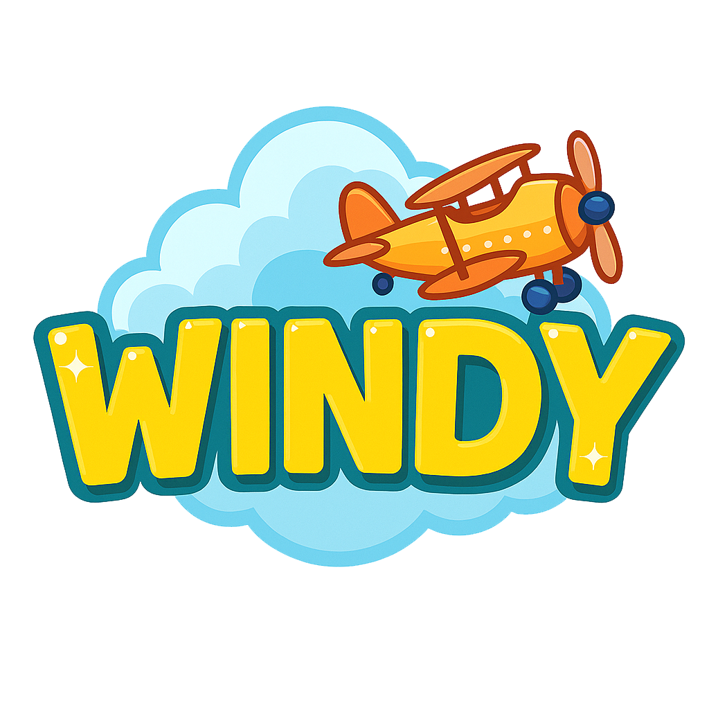
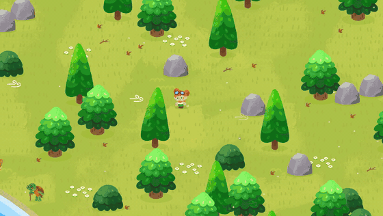
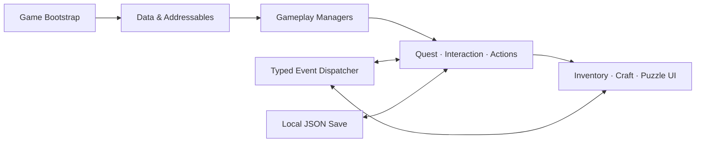

  
  <h1>Windy</h1>
  
<strong>하늘에서 떨어진 작은 비행사, 마을의 길을 다시 잇다.</strong>

  

    비행기 사고로 낯선 숲 마을에 불시착한 윈디가 
    주민들의 부탁을 해결하며 흩어진 기체 조각을 찾아가는 2D 내러티브 어드벤처입니다.
  

  

    
    
    
    
    
  

## Gameplay

  
   
  <a href="./docs/assets/windy-gameplay.mp4"><strong>▶ 전체 플레이 영상 보기</strong></a>
   · 720p · 03:06 · 사운드 포함

## Project Overview

> Windy는 탐험, NPC 중심 퀘스트, 자원 채집, 제작, 길 잇기 퍼즐이 하나의 흐름으로 이어지는 개발 중인 2D 어드벤처 프로토타입입니다.

| 구분 | 내용 |
| --- | --- |
| 장르 | 2D 내러티브 어드벤처 · 코지 탐험 |
| 핵심 루프 | 탐험 → 대화/퀘스트 → 채집 → 제작 → 퍼즐 → 월드 변화 |
| 구현 콘텐츠 | 3개 퀘스트 그룹 · 19개 퀘스트 단계 · 아이템/레시피 기반 진행 |
| 개발 환경 | Unity 6000.3.7f1 · C# · URP 2D |
| 개발 기간 | 2024.08 시작 · 약 3개월 |
| 팀 구성 | 2인 개발 |
| 담당 역할 | Unity 클라이언트 전체 개발 전담 |
| 개발 상태 | Prototype · In Development |

## My Contribution

2인 팀에서 **Unity 클라이언트 개발 전반을 단독으로 담당**했습니다.

- 플레이어/NPC 이동, 행동, 상호작용 시스템 구현
- 대화, 퀘스트, 채집, 인벤토리, 제작, 길 잇기 퍼즐 구현
- JSON 기반 게임 데이터와 로컬 진행 상태 저장 구조 설계
- UniTask 비동기 초기화, Addressables 로딩, 이벤트 기반 시스템 구성
- UI 구조, 컷신/카메라 연동, 낮/밤 및 날씨 연출 구현
- 퀘스트 데이터, 맵 배치, 퍼즐 제작을 위한 Unity Editor 도구 개발

## Core Gameplay

### 탐험과 NPC 퀘스트

- 월드 공간 상호작용 UI와 타이핑 대화 연출
- 단일/다중 NPC 대화, 아이템 전달, 퍼즐 완료 조건을 조합한 퀘스트 진행
- 퀘스트 단계에 따라 다리와 오브젝트 상태가 바뀌는 월드 변화

### 채집과 제작

- 필드 자원 획득과 인벤토리 관리
- 망치, 도끼, 곡괭이를 활용한 환경 오브젝트 상호작용
- JSON 레시피를 기반으로 한 도구 및 퍼즐 조각 제작

### 길 잇기 퍼즐

- 퍼즐 조각을 드래그해 배치하고 90도 단위로 회전
- 시작점부터 끝점까지 연결 상태를 추적해 정답 판정
- 다리와 사다리를 완성하면 퀘스트 및 컷신으로 자연스럽게 연결

### 살아 있는 2D 월드

- URP `Light2D`를 이용한 낮/밤 전환
- 맑음, 바람, 비를 표현하는 환경 효과
- Spine 캐릭터 애니메이션과 Cinemachine/Timeline 컷신

## Technical Highlights

| 영역 | 구현 내용 | 대표 코드 |
| --- | --- | --- |
| Data-driven Content | 퀘스트, 대화, 아이템, 레시피를 JSON 테이블로 분리하고 컨테이너에서 로드 | [`DataContainer`](./Assets/Scripts/GameSystem/DataContainer.cs) · [`Quest`](./Assets/Scripts/GameSystem/Mission/Quest.cs) |
| Async Bootstrap | UniTask로 데이터, Addressables, 매니저, UI 초기화 순서를 명시적으로 제어 | [`Game`](./Assets/Scripts/Game.cs) · [`AddressableManager`](./Assets/Scripts/GameSystem/AddressableManager.cs) |
| Modular Gameplay | 캐릭터 행동과 상호작용을 재사용 가능한 Action/Controller 구조로 분리 | [`ActController`](./Assets/Scripts/Creature/Action/ActController.cs) · [`InteractionMediator`](./Assets/Scripts/Creature/Characters/InteractionPlayableMediator.cs) |
| Event-driven Flow | 타입 기반 `EventDispatcher`로 퀘스트, 아이템, 레시피, UI 갱신을 느슨하게 연결 | [`EventDispatcher`](./Assets/Scripts/GameSystem/Event/EventDispatcher.cs) |
| UI Architecture | View/Presenter/Service와 제네릭 UI Creator를 이용해 화면 로직과 표시 로직을 분리 | [`CraftPresenter`](./Assets/Scripts/UI/CraftPresenter.cs) · [`PathFindPuzzleService`](./Assets/Scripts/UI/Puzzle/PathFindPuzzleService.cs) |
| Asset Management | Addressables 라벨 로딩과 ID 기반 캐시로 캐릭터 및 월드 오브젝트 관리 | [`AddressableManager`](./Assets/Scripts/GameSystem/AddressableManager.cs) |
| Local Persistence | 인벤토리, 퀘스트, 레시피, 퍼즐 진행 상태를 로컬 JSON으로 저장 | [`ApiClient`](./Assets/Scripts/Network/ApiClient.cs) · [`InfoManager`](./Assets/Scripts/InfoManager.cs) |
| Editor Tooling | 퀘스트 데이터, 맵 배치, 가시성 규칙, 퍼즐 그리드를 위한 커스텀 에디터 구성 | [`MapPlacementTool`](./Assets/Scripts/Editor/MapPlacementTool.cs) · [`PuzzleGridInspector`](./Assets/Scripts/UI/Puzzle/Editor/PuzzleGridInspector.cs) |

## System Architecture

## Controls

| 입력 | 동작 |
| --- | --- |
| `WASD` / 방향키 | 이동 |
| `Space` | 대화, 아이템 줍기, 대사 진행, 도구 사용 |
| `Tab` | 인벤토리 및 레시피 UI 열기/닫기 |
| 마우스 드래그 | 퍼즐 조각 이동 |
| 배치한 조각 클릭 | 퍼즐 조각 90도 회전 |
| `Esc` | 퍼즐 닫기 |

## Tech Stack

- **Engine / Language**: Unity 6000.3.7f1, C#
- **Rendering**: Universal Render Pipeline 17.3.0, 2D Renderer, Light2D
- **Animation / Camera**: Spine 4.2, DOTween, Cinemachine 3.1.4, Timeline 1.8.10
- **Async / Assets**: UniTask 2.5.10, Addressables 2.8.0
- **Data / UI / Navigation**: Newtonsoft.Json, UGUI, TextMesh Pro, NavMeshPlus

## Run Locally

1. Unity Hub에 **Unity 6000.3.7f1**을 설치합니다.
2. 저장소를 클론한 뒤 프로젝트 루트를 Unity Hub에서 엽니다.
3. Build Profiles의 Scene List가 아래 순서인지 확인합니다.
   1. `Assets/1_Scenes/Intro.unity`
   2. `Assets/1_Scenes/ShadewoodVillage.unity`
4. `Intro` 씬을 열고 Play를 실행합니다.
5. 플레이어 빌드가 필요하다면 Addressables 콘텐츠를 먼저 빌드합니다.

> 이 프로젝트는 포트폴리오 공개와 시스템 검증을 위한 프로토타입이며, 기능과 콘텐츠를 계속 확장하고 있습니다.

## English Summary

**Windy** is an in-development 2D narrative adventure prototype where a young pilot explores a forest village, helps its residents, gathers resources, crafts tools, and solves route-building puzzles while searching for scattered aircraft parts. In this two-person project, I was solely responsible for the complete Unity client implementation, including gameplay systems, UI, data flow, asset loading, persistence, editor tooling, and visual integration.
